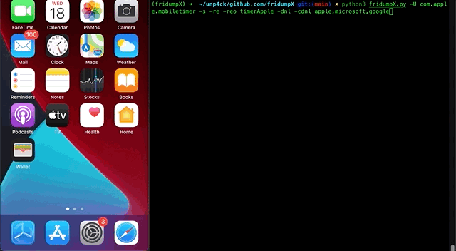
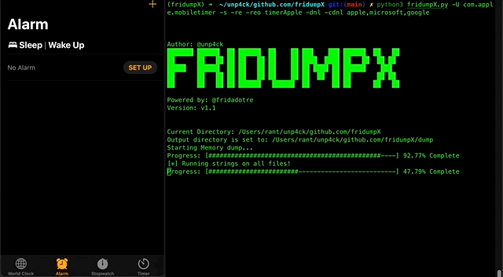

# fridumpX
fridumpX (v1.1) is an open source memory dumping tool and using regex patterns (verify regex.yaml) to grep sensitive information based on these regexs, primarily aimed to **penetration testers and developers** to verify memory information that contains some sensite information at memory, all those information based on regex patterns ( you can find at regex.yaml file). 

**FridumpX** uses Frida framework to dump accessible memory addresses from any platform supported. It can be used from a Windows, Linux or Mac OS X systems to dump the memory of an iOS, Android or Windows application.
---

* **FridumpX** was tested with:

      Frida 16.0.8;
      iOS jailbreaked devices with: 
            - https://checkra.in;
            - https://github.com/palera1n;
            - Note, for iphone X > 14.0 use Xina jailbreak.

* Regex used

      - http and https urls
      - amazon tokens
      - gcp tokens
      - aws 
      - paypal
      - and every regex u want just insert at regex.yaml file

---


### Pocs





Usage
---
```
usage: fridumpX [-h] [-re] [-reo dir] [-o dir] [-U] [-v] [-r] [-s] [--max-size bytes] [-D id] [-H host] [-dnl] [-cdnl CUSTOMDENYLIST] process

Author: @unp4ck
███████ ██████  ██ ██████  ██    ██ ███    ███ ██████  ██   ██
██      ██   ██ ██ ██   ██ ██    ██ ████  ████ ██   ██  ██ ██
█████   ██████  ██ ██   ██ ██    ██ ██ ████ ██ ██████    ███
██      ██   ██ ██ ██   ██ ██    ██ ██  ██  ██ ██       ██ ██
██      ██   ██ ██ ██████   ██████  ██      ██ ██      ██   ██

Powered by: @fridadotre
Version: v1.1

positional arguments:
  process               the process that you will be injecting to

options:
  -h, --help            show this help message and exit
  -re, --regex          use regex to grep juicy info, use the -reo option to save the findings
  -reo dir, --regexout dir
                        dir name after regex findings (def: fridumpx_out
  -o dir, --out dir     provide full output directory path. (def: 'dump')
  -U, --usb             device connected over usb
  -v, --verbose         verbose
  -r, --read-only       dump read-only parts of memory. More data, more errors
  -s, --strings         run strings on all dump files. Saved in output dir.
  --max-size bytes      maximum size of dump file in bytes (def: 20971520)
  -D id, --device id    connect to device with the given id
  -H host, --host host  remote device connected over tcp
  -dnl, --denylist      common patterns to deny while using the regex feature
  -cdnl CUSTOMDENYLIST, --customdenylist CUSTOMDENYLIST
                        custom deny list with comma separated values ex: foo,bar,john,doe
```

#### How to

To find the name of a local process, you can use:

      frida-ps
For a process that is running on a USB connected device, you can use:

      frida-ps -U

Examples:


* Mobile app target, dump the memory and run strings on all dump files (xxxxx.data):

```
python3 fridumpX.py -U com.app.name -s
```

* Any target, Dump the memory of a local application and save it to the specified directory

```
python3 fridumpX -r -o [full_path]
``` 

* Any target, Dump the memory and running regex of a local application files and save it to the specified directory

```
python3 fridumpX -U app.name -re -reo app_target_folder
``` 

* Any target, Dump the memory and running regex of a local application files and save it to the specified directory with DENYLIST

```
python3 fridumpX -U app.name -re -reo app_target_folder -dnl
```

* Deny List and Custom Deny List

```
python3 fridumpX.py -U com.apple.mobiletimer -s -re -reo timerApple -dnl -cdnl apple,microsoft,google
```

      
#### Installation
---
To install fridumpX you just need to clone it from git and run it:

      git clone https://github.com/unp4ck/fridumpX.git

      $ python3 -m pip install -r requirements.txt --user
            
      python3 fridumpX.py -h
            
Pre-requisites
---
To use fridumpX you need to have frida installed on your python environment and frida-server on the device you are trying to dump the memory from.
The easiest way to install frida on your python is using pip:

```

python3 -m install frida frida-tools

```

## FAQ

 This tool are inspired/forked by fridump.

* https://github.com/frida/frida            thanks to @frida
* https://github.com/Nightbringer21/fridump thanks to @Nßightbringer
    
* More information on how to install Frida can be found [here](http://www.frida.re/docs/installation/)

* For iOS, installation instructions can be found [here](http://www.frida.re/docs/ios/).

* For Android, installation instructions can be found [here](http://www.frida.re/docs/android/).

Any suggestions and comments are welcome! @unp4ck

### Contribute

Before open a issue, verify if:

* 1 - Your app have protections like: (anti(root|jailbreak|tamper|sslpinning);
* 2 - Verify if your app targer working correct, try to upgrade your frida to 16.x or 15.x;
* 3 - Verify your frida-tools and frida-version, we not tested versions bellow 14.x;
* 4 - Before SEND a issue verify the steps above and, if possible send your testing app, we cannot simulate your problem without steps to reproduce


### TODO

* 1 - [main task] - Verify why some apps are slow, to running strings grepper!
* 2 - Bypass JB/Root with frida scripts
* 3 - Code Refactory
* 4 - https://blog.csdn.net/freeking101/article/details/107438271

