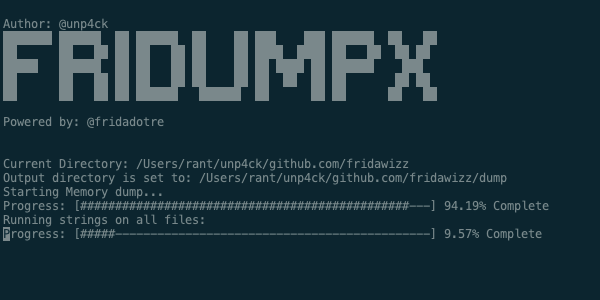
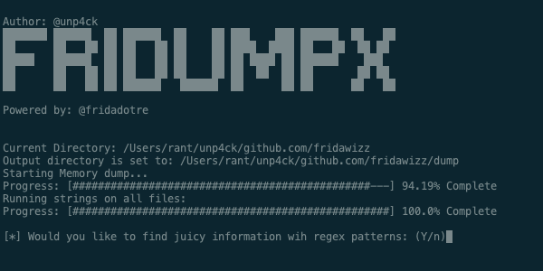
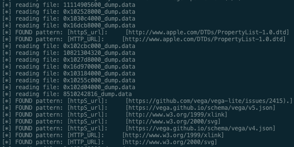

# fridumpX
fridumpX (v0.1) is an open source memory dumping tool and using regex patterns (verify regex.yaml) to grep sensitive information based on these regexs, primarily aimed to penetration testers and developers to verify memory information that contains some internal urls, tokens and anything based on regex patterns. fridumpX is using the Frida framework to dump accessible memory addresses from any platform supported. It can be used from a Windows, Linux or Mac OS X system to dump the memory of an iOS, Android or Windows application. **FridumpX** are inspired by fridump 
https://github.com/Nightbringer21/fridump thanks to @Nightbringer


* Tested with:
      - Frida 16.0.8
      - iOS jailbreaked devices with: 
            - https://checkra.in
            - https://github.com/palera1n
            - Note, for iphone X > 14.9 use Xina jailbreak


* Regexs used:
      [regex.yaml](regex.yaml)
      * http and https urls
      * amazon tokens
      * gcp tokens
      * aws 
      * paypal
      * and every regex u want just insert there

---







Usage
---

How to:

      fridumpX [-h] [-o dir] [-U] [-v] [-r] [-s] [--max-size bytes] process

The following are the main flags that can be used with fridumpX:

      positional arguments:
      process            the process that you will be injecting to

      optional arguments:
      -h, --help         show this help message and exit
      -o dir, --out dir  provide full output directory path. (def: 'dump')
      -U, --usb          device connected over usb
      -D id, --device id  connect to device with the given id
      -v, --verbose      verbose
      -r, --read-only    dump read-only parts of memory. More data, more errors
      -s, --strings      run strings on all dump files. Saved in output dir.
      --max-size bytes   maximum size of dump file in bytes (def: 20971520)

To find the name of a local process, you can use:

      frida-ps
For a process that is running on a USB connected device, you can use:

      frida-ps -U

Examples:

      fridumpX -U Safari   -   Dump the memory of an iOS device associated with the Safari app
      fridumpX -U -s com.example.WebApp   -  Dump the memory of an Android device and run strings on all dump files
      fridumpX -r -o [full_path]  -  Dump the memory of a local application and save it to the specified directory
      
Installation
---
To install fridumpX you just need to clone it from git and run it:

      git clone https://github.com/Nightbringer21/fridumpX.git
            
      python3 fridumpX.py -h
            
Pre-requisites
---
To use fridumpX you need to have frida installed on your python environment and frida-server on the device you are trying to dump the memory from.
The easiest way to install frida on your python is using pip:

```

python3 -m install frida frida-tools

```
    
More information on how to install Frida can be found [here](http://www.frida.re/docs/installation/)

For iOS, installation instructions can be found [here](http://www.frida.re/docs/ios/).

For Android, installation instructions can be found [here](http://www.frida.re/docs/android/).

Note: On Android devices, make sure that the frida-server binary is running as root!

Any suggestions and comments are welcome!


### TODO

```
Bypass JB/Root with frida scripts
Code Refactory
https://blog.csdn.net/freeking101/article/details/107438271
```
